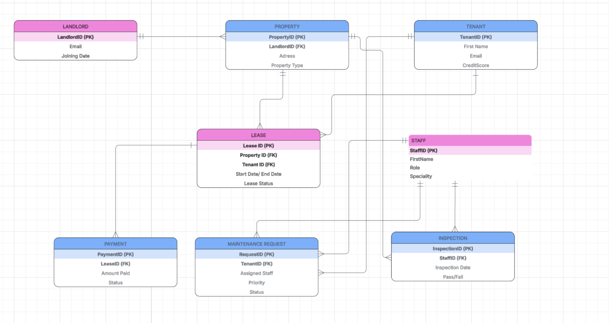
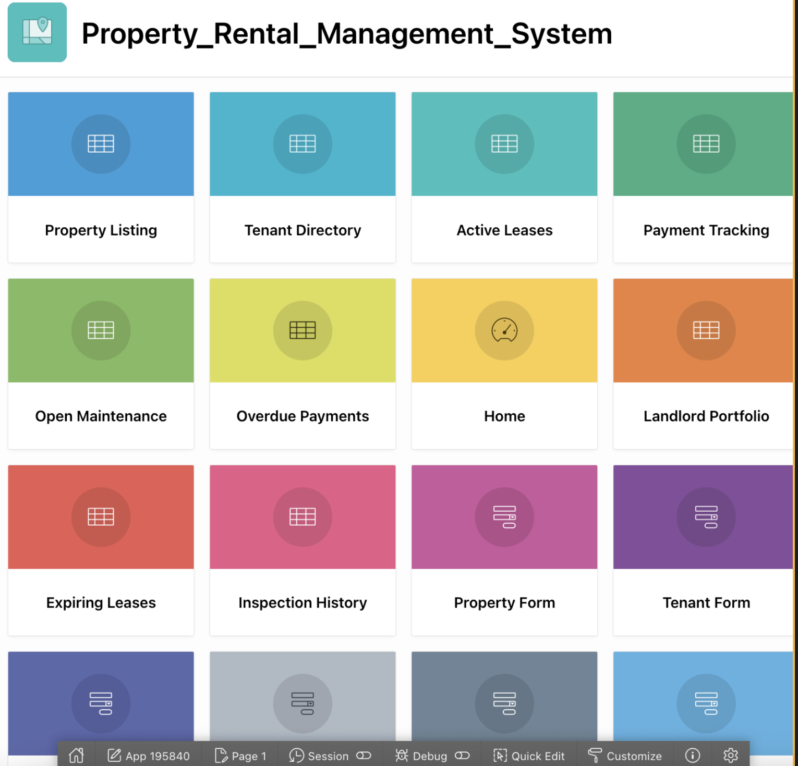
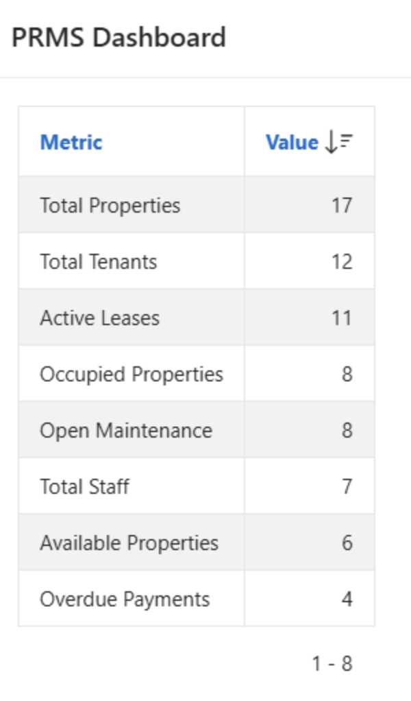
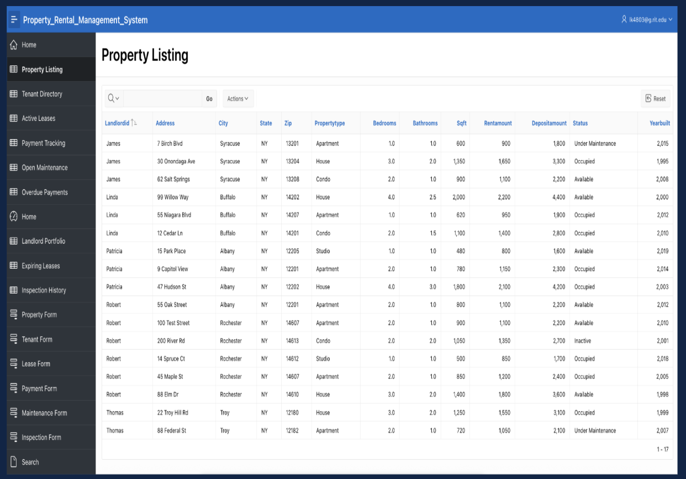
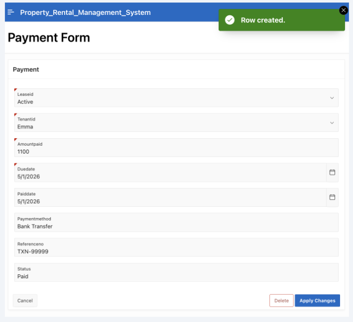
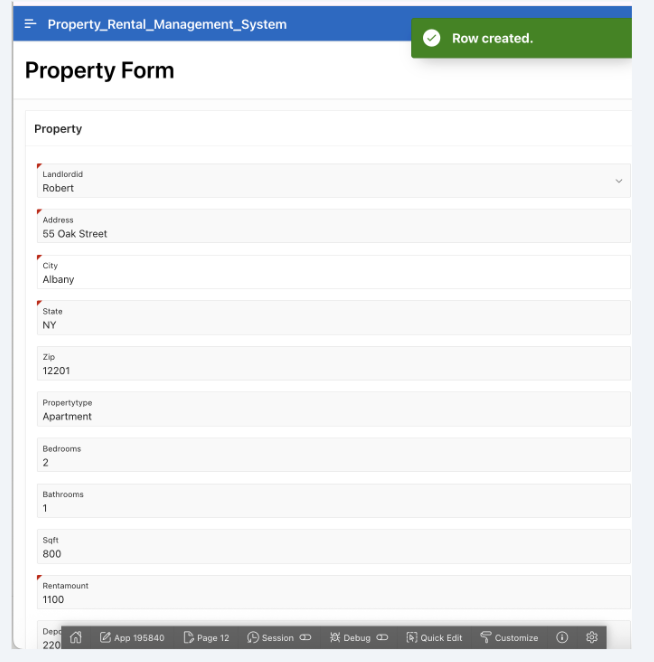
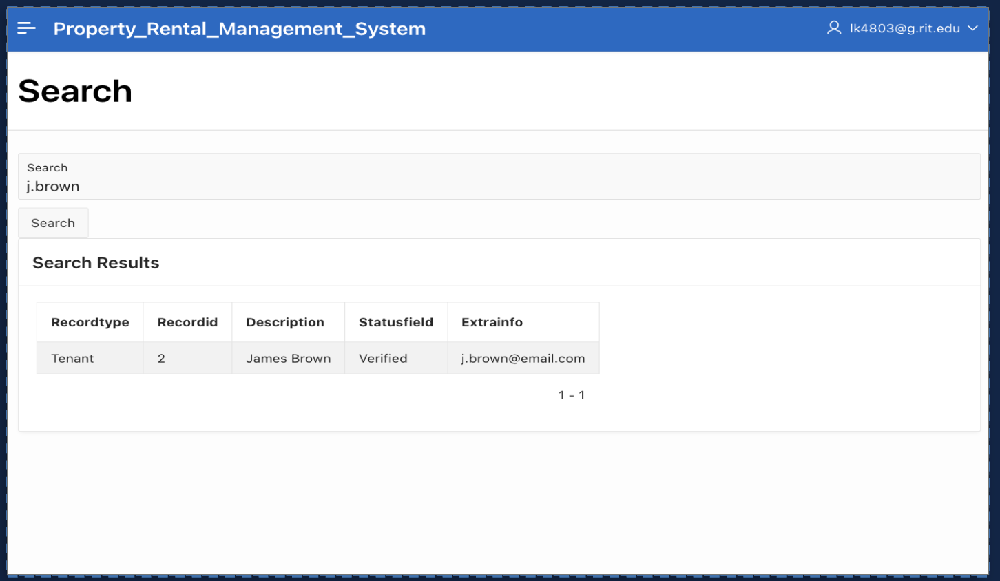
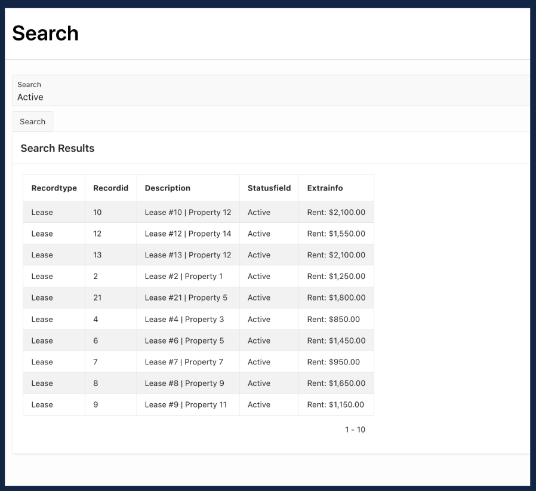
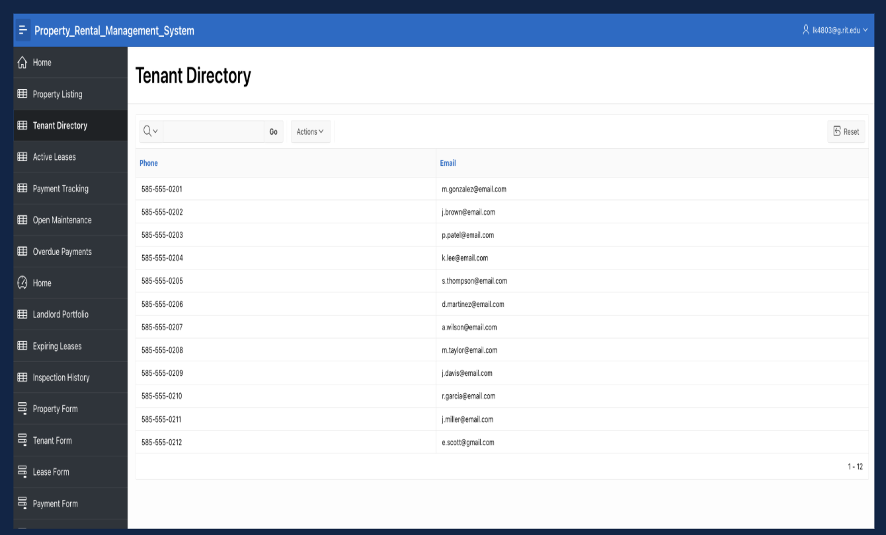

# Property Rental Management System (PRMS)

A full-stack relational database application built on **Oracle APEX** and **PL/SQL** that centralizes property rental operations, replacing fragmented manual workflows with a single, structured system.

---

## Overview

The Property Rental Management System (PRMS) is a database-driven web application designed to manage the complete lifecycle of property rentals. It handles landlord portfolios, tenant onboarding, lease agreements, rent payments, maintenance requests, and property inspections, all backed by a normalized relational schema with enforced business rules.

**Tech Stack:** Oracle Database · Oracle APEX 24.2 · PL/SQL · SQL

---

## The Problem

Small-to-mid-size property management operations typically rely on disconnected tools: paper lease agreements that are slow and easy to lose, Excel spreadsheets for rent tracking with no overdue alerts, email threads for maintenance requests that go missing, and no unified view of a landlord's portfolio across properties.

There is no single source of truth. Data lives in silos, nothing is linked, and reporting requires manual effort every time.

---

## The Solution

PRMS solves this by modeling the entire rental domain as a relational database with 8 interconnected tables, enforced constraints, automated triggers, and a web-based front end built in Oracle APEX.

**What the system does:**

- **Property Management** - Add, edit, and track all rental units with occupancy status, rent amount, property type, and landlord linkage.
- **Tenant Registration** - Register tenants with ID verification, credit score validation (300–850), emergency contact, and move-in date.
- **Lease Management** - Create leases linking a tenant to a property. The system auto-sets lease status to Active and enforces that EndDate must be after StartDate.
- **Payment Tracking** - Record rent payments. A database trigger auto-detects whether the payment is Paid, Partial, or Overdue based on the amount paid vs. monthly rent.
- **Maintenance Requests** - Submit and assign repair requests by priority (Low/Medium/High/Emergency). Emergency requests flag the property as "Under Maintenance."
- **Inspection Logging** - Log Move-In, Move-Out, Routine, Annual, or Emergency inspections with Pass/Fail results and the next due date.
- **Universal Search Engine** - A single search box queries Properties, Tenants, and Leases simultaneously using a UNION ALL query with wildcard matching.
- **Dashboard & Reports** - 9 live reports covering overdue payments, expiring leases, landlord revenue, open maintenance, and inspection history.
- **Analytics** - Bar and pie charts visualizing payment status distribution, maintenance by priority, and property occupancy breakdown.

**Key design decisions:**

- One landlord can own many properties (1:M relationship)
- The Lease table resolves the many-to-many relationship between Tenants and Properties
- Payment is a weak entity dependent on Lease - cascade delete ensures cleanup
- Business-rule triggers automate property status changes when leases are activated or terminated
- Views pre-join 3-4 tables so APEX report pages require zero additional SQL

---

## Skills Used

| Category | Details |
|---|---|
| Database Design | ER modeling, normalization, 8-table relational schema with FK constraints and CHECK constraints |
| SQL | DDL (CREATE TABLE, sequences, indexes), DML (INSERT, UPDATE, DELETE), complex SELECT with JOINs, GROUP BY, UNION ALL |
| PL/SQL | 7 stored procedures, 10 triggers (auto-increment, business rule enforcement), anonymous PL/SQL blocks |
| Oracle APEX | 20-page application with interactive reports, data entry forms with smart dropdowns (LOVs), navigation cards, breadcrumbs, JET charts |
| Data Modeling | Entity-Relationship Diagram, cardinality analysis, constraint design, cascade delete strategy |
| Reporting | 6 database views for pre-joined reporting, dashboard with live aggregate metrics |
| Version Control | Git, GitHub for source control and project documentation |

---

## Repository Structure

```
Property-Rental-Management-System/
│
├── README.md
│
├── database/
│   ├── 01_tables_creation.sql           - 8 tables, 8 sequences, 10 triggers, 12 indexes
│   ├── 02_data_insertion.sql            - Sample data: 17 properties, 12 tenants, 11 leases
│   ├── 03_views.sql                     - 6 database views for reporting
│   ├── 04_stored_procedures.sql         - 7 PL/SQL stored procedures
│   ├── 05_queries.sql                   - SELECT, JOIN, COUNT, GROUP BY queries
│   └── 06_search_engine.sql             - UNION ALL universal search query
│
├── apex/
│   └── f195840.sql                      - Full Oracle APEX application export (20 pages)
│
├── docs/
│   └── PRMS_FinalPresentation.pdf       - Project presentation slides
│
└── screenshots/
    ├── home_dashboard.png
    ├── property_listing.png
    ├── payment_form.png
    ├── search_engine.png
    ├── overdue_payments.png
    └── erd_diagram.png
```

**Execution order:** Run the database scripts in sequence - `01` → `02` → `03` → `04`. Then import `f195840.sql` into an Oracle APEX workspace via App Builder → Import.

---

## Database Schema

**8 Tables** with full referential integrity:

```
LANDLORD  ──1:M──►  PROPERTY  ◄──FK──  INSPECTION
                        │                    │
                        FK                   FK
                        │                    │
   TENANT  ──FK──►   LEASE    ◄──FK──    STAFF
                        │
                     CASCADE
                        │
                     PAYMENT
                        │
   TENANT  ──FK──►  MAINTENANCEREQUEST  ◄──FK──  STAFF
```

**Constraints enforced at the database level:**

- Email format validation on Landlord, Tenant, and Staff tables
- Credit score must be between 300 and 850
- Lease end date must be after start date
- Rent and deposit amounts must be ≥ 0
- Property type restricted to: Apartment, House, Condo, Commercial, Studio, Townhouse
- Payment status restricted to: Paid, Overdue, Partial, Waived
- Maintenance priority restricted to: Low, Medium, High, Emergency
- Cascade delete from Lease to Payment - deleting a lease automatically removes its payments

**Automated business logic (triggers):**

- When a lease status changes to Active → the linked property is automatically marked as Occupied
- When a lease is Expired or Terminated → the property reverts to Available
- When a payment is recorded → the system auto-calculates whether it is Paid, Partial, or Overdue based on the amount vs. the lease's monthly rent

---
## How to Run

1. Create a free Oracle APEX workspace at [apex.oracle.com](https://apex.oracle.com)
2. Navigate to **SQL Workshop → SQL Scripts**
3. Upload and run the database scripts in order: `01_tables_creation.sql` → `02_data_insertion.sql` → `03_views.sql` → `04_stored_procedures.sql`
4. Go to **App Builder → Import** and upload `apex/f195840.sql`
5. Open the application and log in

---

## Result

The completed system provides a fully functional property management application with:

- **8 normalized tables** with 30+ constraints ensuring data integrity at the database level
- **10 triggers** automating key business rules - no manual status updates required
- **6 views** pre-joining tables for instant reporting with zero extra SQL in the front end
- **7 stored procedures** encapsulating reusable business logic
- **20 APEX pages** - 9 interactive reports, 6 data entry forms, a universal search engine, a live dashboard, and an analytics page with charts
- **17 properties, 12 tenants, and 11 active leases** in sample data designed to cover every report scenario (mixed Paid/Overdue/Partial payments, Open/Resolved maintenance, Active/Expired leases)

The project demonstrates end-to-end database application development - from ER modeling and schema design through SQL/PL/SQL implementation to a fully deployed web interface.

---

## Limitations & Future Enhancements

**Current limitations:**
- No role-based authentication - all users see all data
- No automated email alerts for overdue payments
- No PDF upload for lease document storage
- No concurrent access control for multi-user editing

---


**Planned enhancements:**
- Role-based login with separate landlord, staff, and admin views
- Automated overdue payment email notifications
- Tenant self-service portal for submitting maintenance requests
- Integration with payment gateways (Stripe, etc.)

## Screenshots


### ER Diagram


---
### Home Page & Dashboard



---
### Property Listing Report


---

### Payment and Property Form (Smart Dropdowns)





---

### Universal Search Engine





---
### Tenant Directory


---


